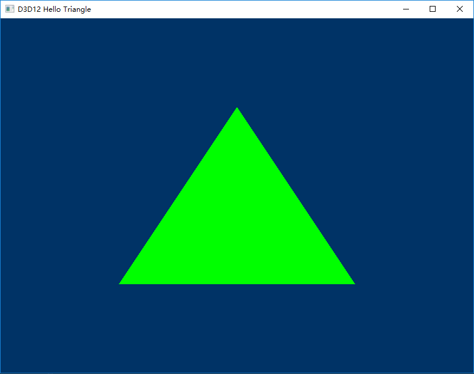
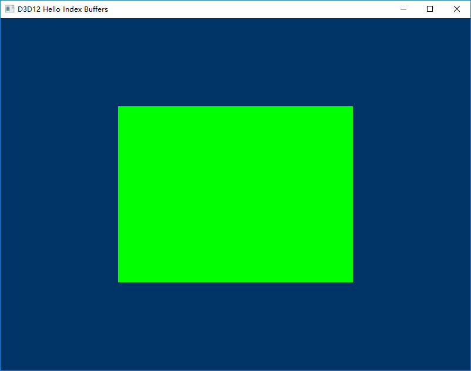

# Driect3D 12 Samples
A collection of Direct3D 12 samples with Visual Studio 2017.

## Hello Triangle Sample
This sample shows you how to draw a static triangle using a vertex buffer.

## Hello Index Buffers Sample
This sample shows you how to draw a quad using index buffers and how to use fences and multiple allocators to queue up multiple frames to the GPU.
